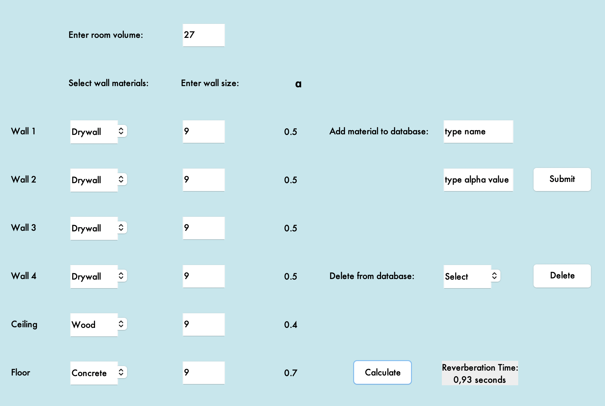

# Reverbtime

A simple Springboot web application using a Swing GUI to calculate reverberation time of a room.
Enter room volume and select the materials of the walls ceiling and floor. The corresponding absorption coefficients (alpha vaules) are retrieved from a database by calling a Rest API.

New materials and their alpha values can be added to the database. Existing entries can be deleted.

This repository contains the source code of both a spring web client as well as the corresponding spring server.

